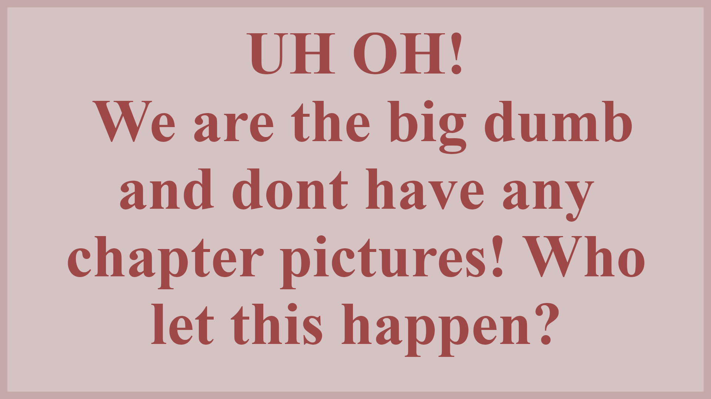

<html>
<head>
	<title>Toledo Triangle Fraternity</title>
	<meta name="viewport" content="width=device-width, initial-scale=1.0">
	<meta charset="UTF-8">
	<meta name="description" content="The website of the Toledo Chapter of Triangle Fraternity.">
	<meta name="keywords" content="triangle,Triangle,toledo,Toledo,ut,UT,rockets,Rockets,fraternity,Fraternity,greek,Greek,ohio,Ohio">
	<meta name="author" content="Ben E., Jason K., Max C., Evan E.">
	<meta http-equiv="refresh" content="30">
	
</head>
<body>
	<header>
		
		<nav style="float:right;font-size:1.5vw;list-style-type:none;margin:0;padding:15px;width:60%">
			<li style="display:inline"><a href="http://endless.horse/" style="display:block;float:right;border:1px solid #bbb;padding:1%">About</a></li>
			<li style="display:inline"><a href="http://endless.horse/" style="display:block;float:right;border:1px solid #bbb;padding:1%">Events</a></li>
			<li style="display:inline"><a href="http://endless.horse/" style="display:block;float:right;border:1px solid #bbb;padding:1%">Spotlight</a></li>
			<li style="display:inline"><a href="http://endless.horse/" style="display:block;float:right;border:1px solid #bbb;padding:1%">Contact</a></li>

		</nav>
		

	</header>
	

		<picture>
			<source media="(min-width:650px)" srcset="media/BigDum.png">
			
		</picture>
		

			
<strong>Something talkin bout picture goes here but theres no picture yet rip.</strong>

		

		

	

	<aside style="float:right;clear:right;padding-top:1%">
		<a class="twitter-timeline" data-width="240" data-height="85%" href="https://twitter.com/TriangleToledo?ref_src=twsrc%5Etfw">Tweets by TriangleToledo</a> 
	</aside>
	<section style="clear:left;text-align:left">
		<h1>Information</h1>
		
Man, too bad we don't have any information either.

	</section>
</body>
</html>