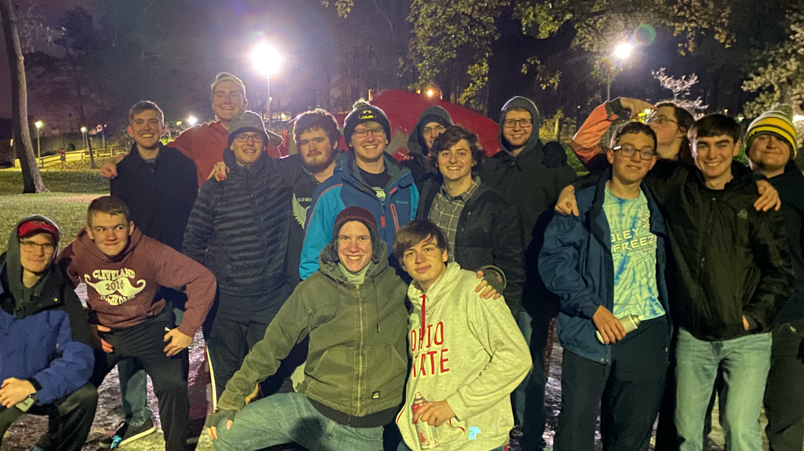

<html>
<head>
	<title>Toledo Triangle Fraternity</title>
	<meta name="viewport" content="width=device-width, initial-scale=1, maximum-scale=1">
	<meta charset="UTF-8">
	<meta name="description" content="The website of the Toledo Chapter of Triangle Fraternity.">
	<meta name="keywords" content="triangle,Triangle,toledo,Toledo,ut,UT,rockets,Rockets,fraternity,Fraternity,greek,Greek,ohio,Ohio">
	<meta name="author" content="Ben E., Jason K., Max C., Evan E.">
	<meta http-equiv="refresh" content="30">
	<link rel="stylesheet" href="HomeStyle.css">
	
</head>
<body>
	<header>
		<nav>
			<li><a href="http://endless.horse/" id="Links">About Us</a></li>
			<li><a href="http://endless.horse/" id="Links">Our Events</a></li>
			<li><a href="http://endless.horse/" id="Links">Brother Spotlight</a></li>
			<li><a href="http://endless.horse/" id="Links">Contact Us</a></li>
			
			<li><a href="index.html" id="Title"><strong>Toledo Triangle Fraternity</strong></a></li>
		</nav>
	</header>
	

		<picture>
			<source media="(min-width:650px)" srcset="media/Main.png">
			
		</picture>
	

	

	

	<section style="background-color:#c08081;padding-bottom:4%;padding-top:0.1%">
		
<strong>Fall 2020 Eboard</strong>

		

		

		

			
			

				<h3 style="font-size:1.1vw">President</h3>
				
<i>The small bio that the president writes about himself will go here. When I get his photo it will replace margus instead.</i>

				
<i>-Michael Jeffery</i>

			
	
			

				<h3 style="font-size:1.1vw">Vice-President</h3>
				
<i>The small bio that the president writes about himself will go here. When I get his photo it will replace margus instead.</i>

				
<i>-Nicholas Ziegelmeyer</i>

			
	
			
		

		

		

		

		

			
			

				<h3 id="PTitle">Recruitment</h3>
				
<i>The small bio that the president writes about himself will go here. When I get his photo it will replace margus instead.</i>

				
<i>-Jason Kahn</i>

			
	
			
			

				<h3 id="PTitle">Social</h3>
				
<i>The small bio that the president writes about himself will go here. When I get his photo it will replace margus instead.</i>

				
<i>-Brendon Stoner</i>

			

			

				<h3 id="PTitle">Academic</h3>
				
<i>The small bio that the president writes about himself will go here. When I get his photo it will replace margus instead.</i>

				
<i>-Michael Hilyard</i>

			
	
				
			

				<h3 id="PTitle">Philanthropy</h3>
				
<i>The small bio that the president writes about himself will go here. When I get his photo it will replace margus instead.</i>

				
<i>-Tom Franczyk</i>

			
	
			
		

		

			
			

				<h3 id="PTitle">New-Member Educator</h3>
				
<i>The small bio that the president writes about himself will go here. When I get his photo it will replace margus instead.</i>

				
<i>-Mark Rooney</i>

			
	
			
			

				<h3 id="PTitle">Treasurer</h3>
				
<i>The small bio that the president writes about himself will go here. When I get his photo it will replace margus instead.</i>

				
<i>-Logan Crawfis</i>

			

			

				<h3 id="PTitle">Resident Advisor</h3>
				
<i>The small bio that the president writes about himself will go here. When I get his photo it will replace margus instead.</i>

				
<i>-Alex Marchand</i>

			
	
				
			

				<h3 id="PTitle">Secretary</h3>
				
<i>The small bio that the president writes about himself will go here. When I get his photo it will replace margus instead.</i>

				
<i>-Evan Elliott</i>

			
	
			
		

	</section>
	

	

	

	

		
Looking to join? yeah me too.

	

</body>
</html>